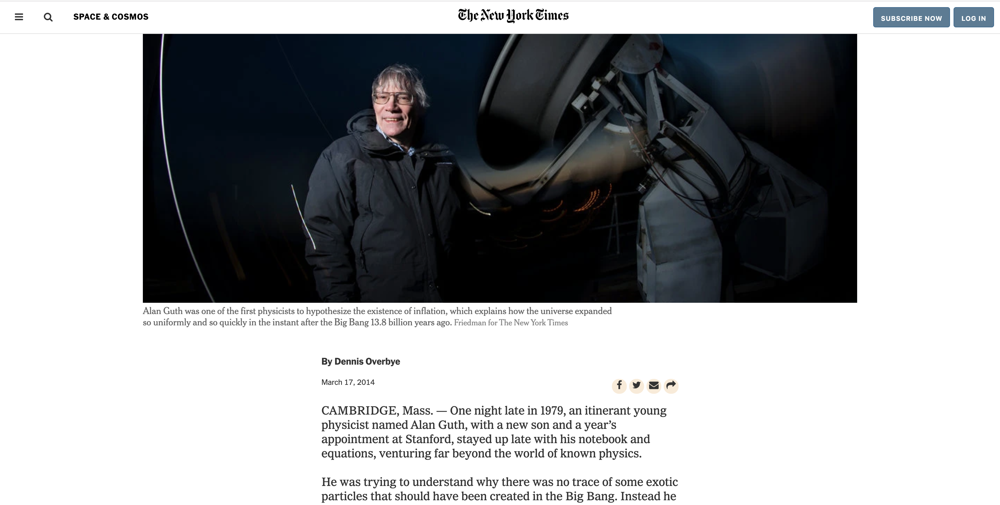

New York Times Web Page

> One paragraph statement about the project.

This project is the cloning content and appearance of the New York Times web page. The main idea was to use the float property and all its features. 

This webpage has two sticky nav-bars, and have different sections that are layout using floats in order to accomplish the layout of an aside bar. 

## Built With

- HTML, CSS

## Live Demo

[Live Demo Link](https://codepen.io/javierbotero1/pen/WNbxNXX)

## Authors

👤 **Author1**

- Github: [@paul-techie](https://github.com/paulo-techie)
- Linkedin: [Paulo Omondi](https://www.linkedin.com/in/paul-o-43051a31/)

👤 **Author2**

- Github: [@javierbotero](https://github.com/javierbotero)
- Twitter: [@javierbotero1](https://twitter.com/JavierBotero1)
- Linkedin: [Javier Botero](https://www.linkedin.com/in/javier-botero-044686155/)

## 🤝 Contributing

Contributions, issues and feature requests are welcome!

Feel free to check the [issues page](issues/).

## Show your support

Give a ⭐️ if you like this project!
